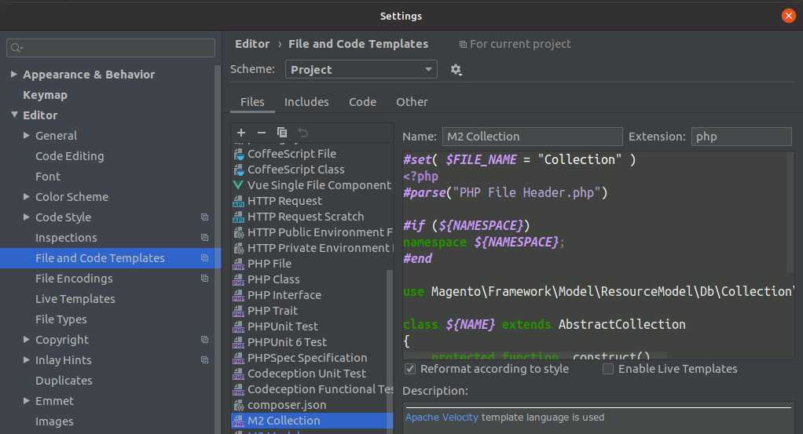
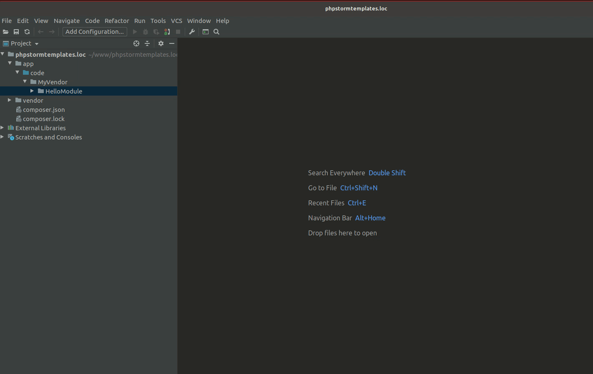

# PhpStorm Code Templates for Magento 2

## Prepare

- Copy directory **fileTemplates** (from this repository) to directory **.idea** in your project
- Go to PhpStorm menu: File - Settings - Editor - File And Code Templates
- Select scheme **Project** and click to Apply button

## How To Use

